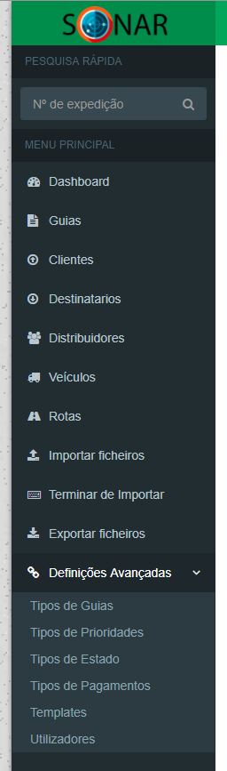
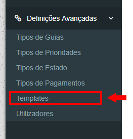

# -- Aplicação orientada para serviço de logística

### Breve descrição:
1. Guias:
    - Informações do veículo
    - Informações do distribuidor
    - Destinatário
    - Montante a ser pago ou devolvido
    - Declaração de incidências

2. Veículos:
   - Matrícula
   - Modelo
   - Ano
   - Gestão de carga máxima (peso)
   - Gestão de volume máximo (m³)

3. Distribuidores:
   - Número de Identificação
   - Expiração de carta de condução (para aviso prévio)
   - Veículo preferido

4. Relatórios/Estatísticas
   - Relatórios diários, semanais e mensais da atividade de cada distribuidor
   - Dados estatísticos que permitem ter a perceção do andamento da sua empresa
   - Gráficos comparativos entre o trabalho efetuado em diferentes alturas

5. Importação e Exportação de Ficheiros
   - Possibilidade de importação de ficheiros Excel (.xls)
   - Possibilidade de exportação para ficheiros Excel (.xls)
   - Criação de templates de importação (definição de linhas e colunas onde se encontra a informação)

# --  Utilização

Efetue o login na aplicação:

Escolha o projeto no qual pretende trabalhar:

Com isto, será redirecionado para a dashboard, onde no menu lateral poderá fazer a navegação para as nossas funcionalidades:

## -- importação de Ficheiros

Para efetuar a importação é necessário ter um template de importação, para a plataforma saber o que importar.

Defina o template seguindo estes passos:

1. Navegue até às Definições Avançadas e selecione a opção Templates:

2.
